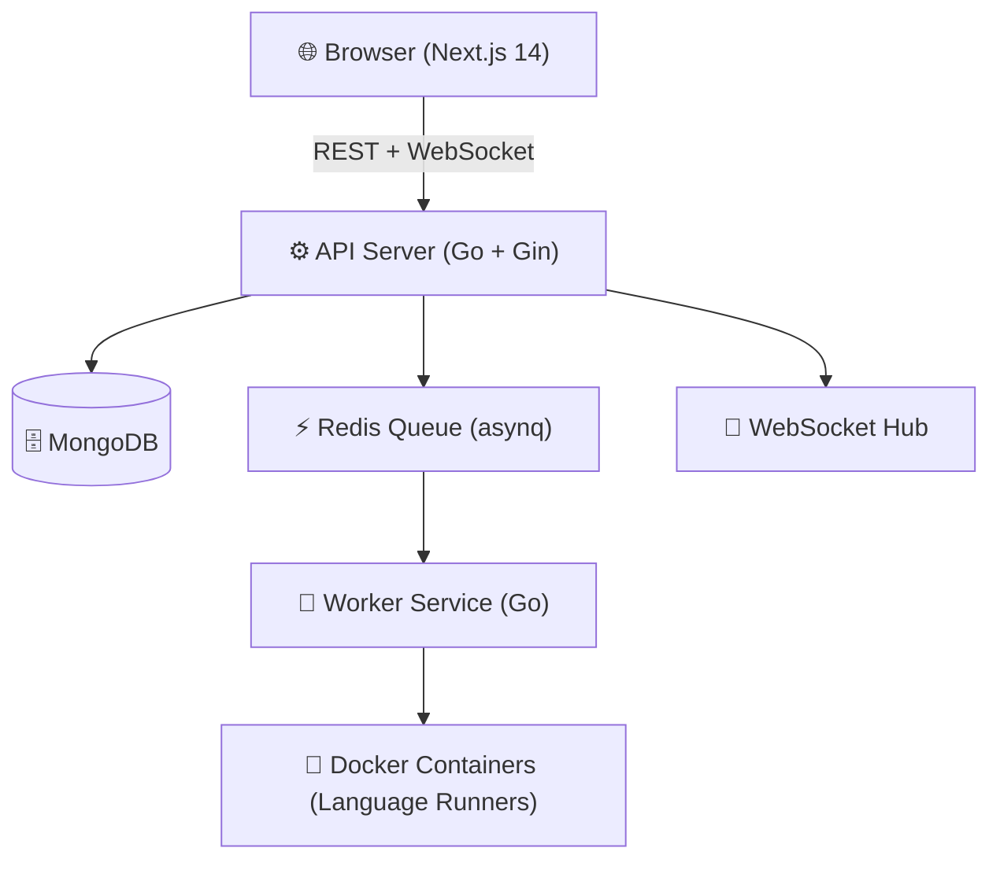

<div align="center">
  
</div>

<p align="center">
  <strong>A production-grade, real-time coding platform built to compete with industry leaders — featuring a unique community problem creation system, live battle mode, and highly optimized code execution.</strong>
</p>

<div align="center">
  
  
  
  
  
</div>

<br />

---

## 🌟 Key Features

- **🔥 Real-time Battle Mode:** Compete 1v1 with other developers in real-time coding clashes.
- **⚡ Live Code Execution:** Run your code in secure, isolated Docker containers.
- **🎨 Premium Dark UI:** Crafted with Tailwind CSS and Framer Motion for a stunning, responsive experience.
- **👥 Community Driven:** Propose, create, and review coding challenges within the platform.
- **🏆 Dynamic Leaderboards:** Climb the ranks, earn points, and stand on the podium.

---

## 🏗 Architecture



---

## 🚀 Quick Start (Frontend Demo)

Experience the UI without the backend setup. The frontend runs in **full demo mode** with rich in-memory mock data.

```bash
# 1. Navigate to the frontend
cd kenyx/frontend

# 2. Install dependencies
npm install

# 3. Start the development server
npm run dev
```

Open **[http://localhost:3000](http://localhost:3000)** in your browser.  
> *Note: You can sign in with any email/password in demo mode.*

---

## 🛠 Full Stack Setup

To run the complete platform, you need Node.js, Go 1.22+, Docker, and a MongoDB instance (like MongoDB Atlas).

### 1️⃣ Database Setup
1. Create a cluster on [MongoDB Atlas](https://www.mongodb.com/cloud/atlas) or run MongoDB locally.
2. Get your connection string (MongoDB URI).

### 2️⃣ Backend Initialization
```bash
cd kenyx/backend
cp .env.example .env  # Update with your MONGODB_URI
docker compose up redis -d
go mod download
go run cmd/api/main.go
# In a separate terminal:
go run cmd/worker/main.go
```

### 3️⃣ Frontend Initialization
```bash
cd kenyx/frontend
npm install
cp .env.local.example .env.local
npm run dev
```

---

## 📂 Code Structure

- `/frontend` - **Next.js 14** application with App Router, Tailwind CSS, Zustand, and Monaco Editor.
- `/backend` - **Go** microservices including the API server, Redis queue worker, and WebSocket Hub.
- `/backend/scratch` - Maintenance and utility scripts.

---

## 💻 Supported Languages

| Language | Environment | Execution Script |
| :--- | :--- | :--- |
| **Python 3** | `kenyx-runner-python` | `solution.py` |
| **JavaScript** | `kenyx-runner-node` | `solution.js` |
| **Go** | `kenyx-runner-go` | `solution.go` |
| **C++** | `kenyx-runner-cpp` | `solution.cpp` |
| **Java** | `kenyx-runner-java` | `Solution.java` |
| **Rust** | `kenyx-runner-rust` | `solution.rs` |

---

## 🌍 Production Deployment

For production, we recommend deploying the **Frontend** on Vercel, the **Backend/Worker** on Railway or Fly.io, and utilizing **Upstash** for serverless Redis. Ensure you use strong secrets and configure SSL.

---

<div align="center">
  <i>Built with ❤️ by the open-source community to redefine competitive programming.</i>
</div>
